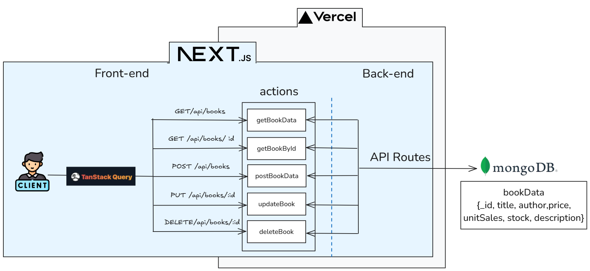

# RGT_ASSIGNMET

## 프로젝트 소개

241207 현재 배포는 되어있으나 배포환경에서 작동하지 못합니다. 로컬에서는 정상 작동중입니다. 감사합니다.


온라인 서점을 위한 웹 애플리케이션.  
이 애플리케이션으로 검색하고, 상세 정보를 보고 편집하며, 각 책의 판매 수량을 확인할수 있습니다.

프론트엔드는 Next.js로 구현했으며, 백엔드 부분은 Next.js api routes로 구현했습니다.
DB는 MOGODB를 사용하였습니다.


## 기술 스택

<p>


</p>

## 구현 기능

### 1. 프론트엔드 (Next.js)

1.  책 목록 페이지 구현

- 페이지네이션 적용 (한 페이지당 10개 항목)
- 제목과 저자로 필터링할 수 있는 검색 기능 구현

2. 책 상세 정보 페이지/뷰 구현
3. 책 추가/제거 및 수량 조절 기능

### 2. 백엔드 (Next.js API routes)

1. 데이터베이스와 통신하는 기본적인 RESTful API 설계 및 구현

- 책 목록 조회 (GET/api/books)
- 책 상세 정보 조회 (GET /api/books/ id)
- 책 추가 (POST /api/books)DELETE/api/books/:id
- 책 정보 수정 (PUT /api/books/:id)
- 책 삭제 (DELETE/api/books/:id)

## 프로젝트 아키텍쳐



## DB


## 실행 방법

```sh
$ git clone https://github.com/theo-jin/RGT_assignment.git
$ pnpm install
$ pnpm run dev
```

## 배포 링크

241207 현재 배포는 되어있으나 배포환경에서 작동하지 못합니다. 로컬에서는 정상 작동중입니다. 감사합니다.

https://rgt-assignment.vercel.app/
